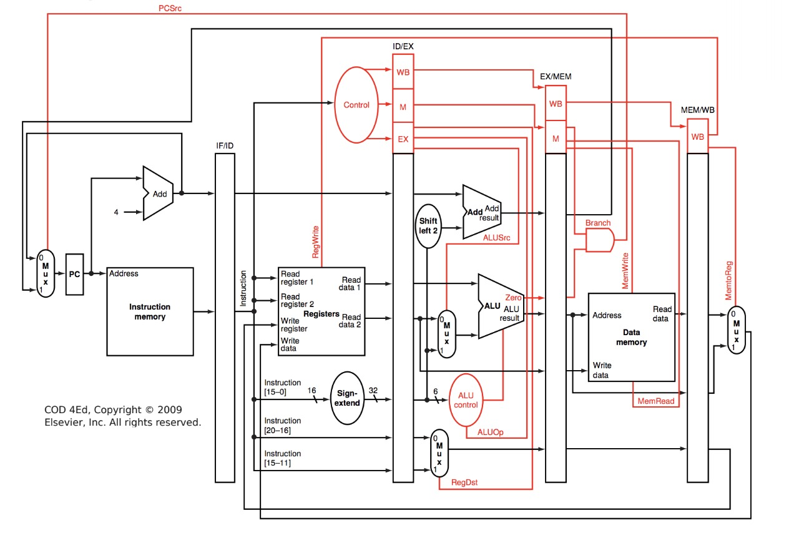
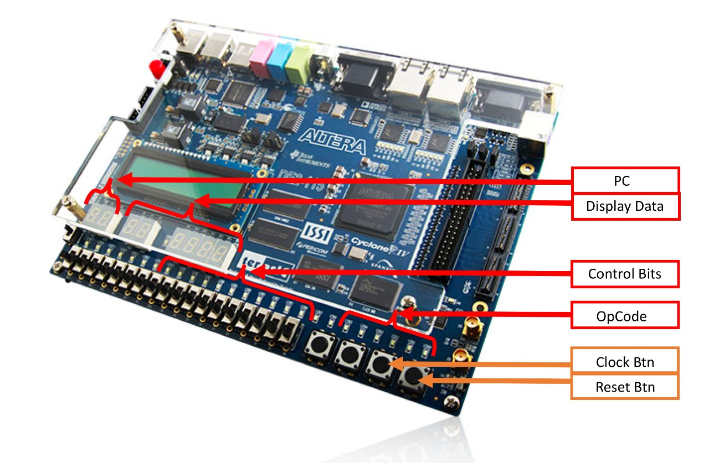

# MIPS

A MIPS hardware design for the Computer Design Discipline (6th semester) Computer Engineering @ [Insper](https://www.insper.edu.br/en/).

## The Processor

Implemented pipeline version of the [MIPS processor](https://en.wikipedia.org/wiki/MIPS_architecture).

The concept was to develop a MIPS architecture processor in VHDL, that would run on a Altera FPGA board.

With the goal of learning computer design by doing, we implemented a instruction-set of 9 instructions, that run in a pipeline.

### Single-Cycle Implementation

An available Single-cycled version of the MIPS Processor can be found in the [md-working](https://github.com/MatheusDMD/MIPS/tree/md-working) branch.

### Pipeline Implementation

### Diagram

**in black:** the Dataflow
**in red:** the Control unit

### Implementation

**Top Level Entity:** [MIPS](./MIPS.vhd)
Handles the interaction between the [Dataflow](./FluxoDeDados.vhd) and [ControlUnit](./UnidadeDeControle.vhd)

**Program:** [Instruction Program](./program.txt)

### Limitations

The current implementation of the processor doesn't handle Hazards.
Meaning that any instruction conflict needs to be solved with *nops* in the compiler.

### Board Layout

This images shows the usage of the board functionalities.

## Implemented instruction-set

This version of MIPS instruction set counts with the following instructions:

#### R-Type
- ADD
- SUB
- AND
- OR
- SLT

#### I-Type
- LW
- SW

#### J-Type
- BEQ
- JUMP

## Next-Steps

- **Hazard prevention**
- Refactor components using 'generic'

## Authors

- [Gabi Almeida](https://github.com/gabicfa)
- [Matheus Marotzke](https://github.com/MatheusDMD/)